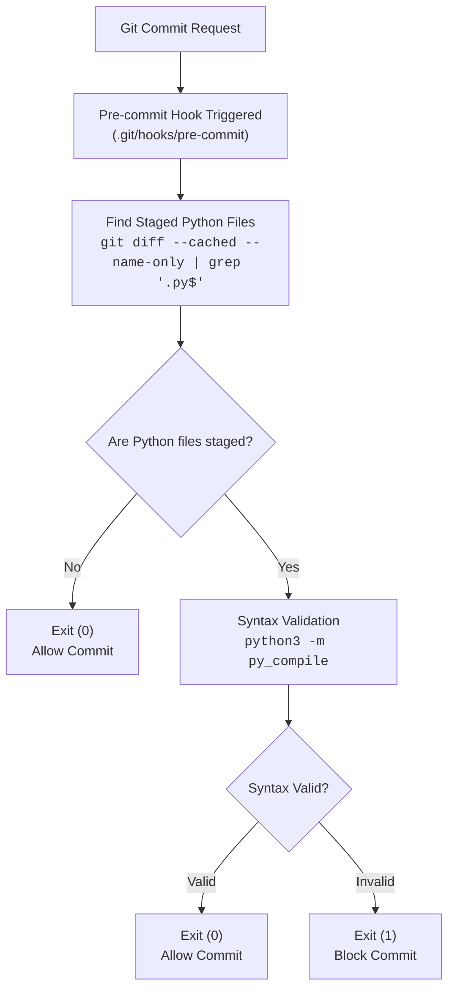

# 🚀 Git Hooks Automation Suite

> Automated Python syntax validation with Git pre-commit hooks

[](https://github.com/chandannmahatoo/git-hooks-automation-suite)
[](https://github.com/chandannmahatoo/git-hooks-automation-suite/releases/tag/v1.0)
[](https://www.python.org/)
[](LICENSE)

## 🎯 Overview

This project implements a Git pre-commit hook that validates Python syntax before a commit is allowed to proceed. It helps maintain code quality by catching syntax problems early in the development workflow.

### Why Pre-commit Hooks?
- 🛡️ Prevent syntax errors from reaching the repository
- ⚡ Catch issues immediately while the context is still fresh
- 📚 Enforce consistent coding standards across contributors
- 🔄 Automate routine validation without manual intervention

## 📋 Table of Contents
- [Features](#features)
- [Tech Stack](#tech-stack)
- [Architecture](#architecture)
- [Requirements](#requirements)
- [Installation](#installation)
- [Usage](#usage)
- [Demo](#demo)
- [Testing](#testing)
- [Project Structure](#project-structure)
- [Configuration](#configuration)
- [Example Outputs](#example-outputs)
- [Troubleshooting](#troubleshooting)
- [Contributing](#contributing)
- [Version History](#version-history)
- [License](#license)
- [Author](#author)
- [Acknowledgments](#acknowledgments)
- [Support](#support)

## ✨ Features

- ✅ Automatic Python syntax validation using `py_compile`
- 🚫 Blocks commits when syntax errors are detected
- 📝 Provides clear error messages with file and line information
- 🔧 Supports customizable validation behavior
- 🎯 Checks only staged Python files, not the entire repository
- ⚡ Runs quickly with minimal impact on commit performance
- 🔄 Allows bypassing the check with `--no-verify` when necessary

### Validation Checks
- Python syntax errors
- Indentation errors
- Missing parentheses or brackets
- Invalid Python constructs
- Compilation errors

## 🧰 Tech Stack

- Python 3.8+
- Git Hooks
- Bash
- `py_compile`
- `pytest`

## 🏗️ Architecture

When you run `git commit`, Git executes the pre-commit hook before creating the commit object. This hook runs early in the commit lifecycle so syntax issues can be detected before changes are recorded in the repository history.

The hook inspects the files staged for commit by using `git diff --cached --name-only` and filters the result to Python files with a `.py` extension. This approach keeps the validation targeted and efficient, avoiding a full-repository scan.

For each discovered file, the hook uses `python -m py_compile` to compile the source without executing it. This validates syntax and catches common problems such as indentation mistakes, missing delimiters, and invalid Python constructs. If every staged Python file passes validation, the commit proceeds; otherwise, the hook exits with a non-zero status and Git blocks the commit until the errors are fixed.



## 📦 Requirements

- Git 2.0+
- Python 3.8+
- Bash shell
- macOS/Linux, or Git Bash on Windows

## 🚀 Installation

### 1. Clone the Repository
```bash
git clone https://github.com/chandannmahatoo/git-hooks-automation-suite.git
cd git-hooks-automation-suite
```

### 2. Set Up a Virtual Environment (Recommended)
```bash
# Create a virtual environment
python3 -m venv venv

# Activate it
source venv/bin/activate  # On macOS/Linux
# venv\Scripts\activate   # On Windows
```

### 3. Install Dependencies
```bash
pip install -r requirements.txt
```

### 4. Install the Pre-commit Hook
```bash
# Make the hook executable
chmod +x .git/hooks/pre-commit

# Verify installation
ls -la .git/hooks/pre-commit
# Expected output: -rwxr-xr-x
```

### 5. Test the Hook
```bash
# Test with a valid Python file
echo "print('Hello World')" > test.py
git add test.py
git commit -m "Test valid file"
# ✅ Should succeed

# Test with an invalid Python file
echo "print 'Hello World'" > invalid.py
git add invalid.py
git commit -m "Test invalid file"
# ❌ Should fail with a syntax error
```

## 🚀 Usage

The hook runs automatically on every `git commit` once it is installed.

```bash
# Normal commit - the hook will run
git add file.py
git commit -m "Add new feature"
```

### Bypass the Hook (Emergency Only)
```bash
git commit --no-verify -m "Emergency fix"
# Or use the short form
git commit -n -m "Emergency fix"
```

### Manual Validation
```bash
# Validate specific files
python3 -m py_compile file1.py file2.py

# Validate all Python files in src/
find src/ -name "*.py" -exec python3 -m py_compile {} \;
```

### View Hook Logs
```bash
# See hook output
GIT_TRACE=1 git commit

# See detailed hook execution
bash -x .git/hooks/pre-commit
```

## 🎬 Demo

### Successful Commit
```bash
$ git add src/main.py
$ git commit -m "Add feature"
🔍 Running pre-commit checks...
📝 Checking Python syntax for:
src/main.py
✅ All checks passed. Proceeding with commit.
[main abc1234] Add feature
 1 file changed, 10 insertions(+)
```

### Failed Commit
```bash
$ git add src/broken.py
$ git commit -m "Add broken code"
🔍 Running pre-commit checks...
📝 Checking Python syntax for:
src/broken.py
  File "src/broken.py", line 5
    print "Error"
    ^^^^^^^^^^^^
SyntaxError: Missing parentheses in call to 'print'
❌ Python syntax errors found. Commit blocked.
```

## 🧪 Testing

### Run All Tests
```bash
pytest tests/
```

### Test Scenarios

#### ✅ Valid Python File
```bash
echo "print('Valid syntax')" > valid.py
git add valid.py
git commit -m "Add valid Python"
# ✅ Expected: Commit succeeds
```

#### ❌ Invalid Python File
```bash
echo "print 'Invalid syntax'" > invalid.py
git add invalid.py
git commit -m "Add invalid Python"
# ❌ Expected: Commit is blocked with a syntax error
```

#### 📝 No Python Files
```bash
touch README.md
git add README.md
git commit -m "Update documentation"
# ✅ Expected: Validation is skipped
```

### Manual Hook Testing
```bash
# Run the hook directly
.git/hooks/pre-commit

# Test with specific files
python3 src/main.py --validate file1.py file2.py
```

## 📁 Project Structure

```text
git-hooks-automation-suite/
├── .git/
│   └── hooks/
│       └── pre-commit
├── docs/
│   ├── architecture.md
│   └── execution-walkthrough.md
├── src/
│   ├── __init__.py
│   ├── main.py
│   └── validators/
│       ├── __init__.py
│       └── python_syntax.py
├── tests/
│   ├── __init__.py
│   ├── test_hook.py
│   ├── test_invalid_python.py
│   └── test_valid_python.py
├── .gitignore
├── README.md
├── requirements.txt
└── setup.py
```

## 🔧 Configuration

### Customize the Hook

To change the hook behavior, edit `.git/hooks/pre-commit`:

```bash
# Add flake8 checks
echo "🔍 Running flake8..."
flake8 $STAGED_PYTHON_FILES || exit 1

# Add black formatting
black $STAGED_PYTHON_FILES
git add $STAGED_PYTHON_FILES

# Exclude test files
STAGED_PYTHON_FILES=$(git diff --cached --name-only | grep '\.py$' | grep -v 'tests/')
```

### Use the Pre-commit Framework

Install and use the pre-commit framework:

```bash
# Install pre-commit
pip install pre-commit

# Install the hooks
pre-commit install

# Run against all files
pre-commit run --all-files
```

## 📊 Example Outputs

### Successful Commit
```bash
$ git commit -m "Add feature"
🔍 Running pre-commit checks...
📝 Checking Python syntax for:
src/main.py
✅ All checks passed! Proceeding with commit.
[main abc1234] Add feature
 1 file changed, 10 insertions(+)
```

### Blocked Commit
```bash
$ git commit -m "Add broken code"
🔍 Running pre-commit checks...
📝 Checking Python syntax for:
src/broken.py
  File "src/broken.py", line 5
    print "Error"
    ^^^^^^^^^^^^
SyntaxError: Missing parentheses in call to 'print'
❌ Python syntax errors found! Commit blocked.
Fix the errors above and try again.
💡 Use 'git commit --no-verify' to bypass this check (not recommended)
```

### Skipped Validation
```bash
$ git commit -m "Update docs"
🔍 Running pre-commit checks...
✅ No Python files staged. Skipping validation.
[main def5678] Update docs
 1 file changed, 5 insertions(+)
```

## 🐛 Troubleshooting

### Common Issues

| Issue | Solution |
|-------|----------|
| **Hook not running** | `chmod +x .git/hooks/pre-commit` |
| **Python not found** | Use `#!/usr/bin/env python3` in the hook |
| **Permission denied** | `sudo chown $USER .git/hooks/pre-commit` |
| **"No such file" error** | Ensure the file exists in the working directory |
| **Hook bypassed accidentally** | Use `git commit --no-verify` intentionally |
| **Windows compatibility** | Use WSL or Git Bash |

### Debug Commands
```bash
# Check hook permissions
ls -la .git/hooks/pre-commit

# Test the hook manually
bash .git/hooks/pre-commit

# See what is staged
git diff --cached --name-only

# View hook execution
bash -x .git/hooks/pre-commit
```

## 🤝 Contributing

Contributions are welcome. To get started:

### 1. Fork the Repository
```bash
git clone https://github.com/yourusername/git-hooks-automation-suite.git
cd git-hooks-automation-suite
git remote add upstream https://github.com/chandannmahatoo/git-hooks-automation-suite.git
```

### 2. Create a Feature Branch
```bash
git checkout -b feature/amazing-feature
```

### 3. Make Your Changes
- Add tests for new features
- Update documentation
- Follow Python style guidelines (PEP 8)

### 4. Run Tests
```bash
pytest tests/
```

### 5. Commit with the Hook
```bash
git add .
git commit -m "Add amazing feature"
# The hook will validate your changes
```

### 6. Push and Create a Pull Request
```bash
git push origin feature/amazing-feature
# Open a pull request on GitHub
```

## 📝 Version History

### v1.0 (Current)
- ✅ Initial release
- ✅ Python syntax validation
- ✅ Pre-commit hook implementation
- ✅ Test suite
- ✅ Documentation

### Future Roadmap
- [ ] Add flake8 integration
- [ ] Support additional languages
- [ ] Add a pre-push hook with tests
- [ ] Add commit message validation
- [ ] Add a Docker container for CI/CD

## 📄 License

This project is licensed under the MIT License. See the [LICENSE](LICENSE) file for details.

## 👤 Author

**Chandan Kumar Mahato**
- GitHub: [@chandannmahatoo](https://github.com/chandannmahatoo)
- Project: [Git Hooks Automation Suite](https://github.com/chandannmahatoo/git-hooks-automation-suite)

## 🙏 Acknowledgments

- [Git Hooks Documentation](https://git-scm.com/docs/githooks)
- [Python Documentation](https://docs.python.org/3/)
- [Pre-commit Framework](https://pre-commit.com/)

## ⭐ Support

If you find this project useful, please consider:
- ⭐ Starring the repository
- 🐛 Reporting issues
- 🔧 Contributing code
- 📣 Sharing it with others

---

Built with ❤️ for the developer community.