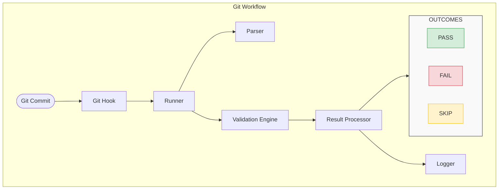

# Git Hooks Automation Suite — Architecture Document

**Version:** 1.0  
**Date:** 22 June 2026  
**Status:** Draft  
**Author:** [Your Name]

---

## Table of Contents

1. [Overview](#1-overview)
2. [Architecture Diagram](#2-architecture-diagram)
3. [Component Overview](#3-component-overview)
4. [Component Interactions](#4-component-interactions)
5. [Execution Walkthrough](#5-execution-walkthrough)
6. [Architecture Decisions](#6-architecture-decisions)
7. [Outcome Summary](#7-outcome-summary)
8. [Related Documentation](#8-related-documentation)

---

## 1. Overview

### 1.1 Purpose

The Git Hooks Automation Suite is a tool that automates pre-commit checks to enforce code quality, security, and consistency. It runs automatically when a developer attempts to commit code.

### 1.2 Goals

| Goal | Description |
|------|-------------|
| **Automation** | Run checks automatically on every commit |
| **Quality** | Enforce linting, formatting, and testing standards |
| **Security** | Scan for secrets and credentials |
| **Extensibility** | Easy to add new checks |
| **Developer Experience** | Clear feedback when checks fail |

### 1.3 Scope

| In Scope | Out of Scope |
|----------|--------------|
| Pre-commit hooks | Post-commit hooks |
| Configurable checks | CI/CD integration |
| Console + file logging | Web dashboard |
| YAML/JSON config | GUI configuration |

---

## 2. Architecture Diagram

### 2.1 Flow Diagram

*See `git-hook-execution-flow.mmd` for editable source.*

### 2.2 Key Flow Paths

| Path | Outcome |
|------|---------|
| Commit → Git → Pre-Commit → Runner → Config → Parser → Hook Enabled? → Validation Engine → Result Processor → Logger → PASS | ✅ Commit Created |
| Commit → ... → Validation Engine → Result Processor → Logger → FAIL | ❌ Commit Blocked |
| Commit → ... → Parser → Hook Enabled? → SKIP | ✅ Commit Created |

---

## 3. Component Overview

| # | Component | Responsibility |
|---|-----------|----------------|
| 1 | **Git Hook** | Entry point triggered by `git commit` |
| 2 | **Hook Runner** | Orchestrates the entire execution flow |
| 3 | **Configuration Parser** | Reads and validates `config.yml` |
| 4 | **Validation Engine** | Executes checks (Lint, Tests, Secrets, etc.) |
| 5 | **Result Processor** | Aggregates and evaluates results |
| 6 | **Logger** | Logs all execution details |

---

## 4. Component Interactions

### 4.1 Interaction Flow

### 4.2 Component Communication

| From → To | Communication | Data |
|-----------|---------------|------|
| Git → Hook | Process call | Commit context |
| Hook → Runner | Script execution | Config path |
| Runner → Parser | Function call | Config file |
| Parser → Runner | Return | Parsed config object |
| Runner → Validation Engine | Function call | Config object |
| Validation Engine → Result Processor | Return | Validation results |
| Result Processor → Logger | Function call | Results + metadata |
| Logger → Console/File | Write | Log entries |

---

## 5. Execution Walkthrough

### 5.1 Step-by-Step Flow

#### Step 1: Developer Initiates Commit
Developer executes `git commit -m "feature implementation"`.

Git captures the commit message and identifies staged files.

#### Step 2: Git Triggers Pre-commit Hook
Git checks `.git/hooks/pre-commit` script. The script executes, passing the commit context to the hook system.

#### Step 3: Hook Runner Initialization
The hook runner process starts with proper environment setup. It validates dependencies and initializes the logging subsystem.

#### Step 4: Configuration Loading
The Hook Runner loads configuration from `config.yml`. If missing, uses defaults.

#### Step 5: Configuration Parsing
The Configuration Parser reads the YAML file. Parses validation rules and builds an internal configuration object.

#### Step 6: Hook Enabled Check
System checks if the pre-commit hook is enabled in configuration. If disabled → SKIP.

#### Step 7: Validation Engine Initialization
Initializes all validation components. Loads rule definitions and dependencies.

#### Step 8: Run Validations

| Check | Description |
|-------|-------------|
| **File Size Check** | Validates no file exceeds configured size limit |
| **Linting Check** | Runs linters on staged files |
| **Test Execution** | Runs unit tests related to changed code |
| **Secrets Scanning** | Checks for secrets/credentials in commits |
| **Format Check** | Verifies code format compliance |

#### Step 9: Collect Results
Each validation returns a result (pass/fail/warning). Results are aggregated with metadata.

#### Step 10: Log Execution Details
Records all validation activity to the log file (timestamp, validations run, status, duration, errors).

#### Step 11: Determine Outcome

| Outcome | Result |
|---------|--------|
| PASS | ✅ Commit Created |
| FAIL | ❌ Commit Blocked |
| SKIP | ✅ Commit Created |

---

## 6. Architecture Decisions

### Summary of Key Decisions

| # | Decision | Rationale |
|---|----------|-----------|
| 1 | **Use YAML for config** | Human-readable. Common in DevOps. |
| 2 | **Use Bash for runner** | Pre-installed on all Unix systems. No dependencies. |
| 3 | **Modular validation engine** | Extensible. Easy to add new checks. |
| 4 | **Dual-output logger** | Console + file for feedback + debugging. |
| 5 | **Explicit outcome handling** | Clear developer experience. |

### Decision Details

See [ADR-001: Hook Runner Architecture](../decisions/adr-001-hook-runner.md) for full details.

---

## 7. Outcome Summary

| Outcome | Condition | Git Exit Code | Developer Experience |
|---------|-----------|---------------|---------------------|
| **PASS** | All validations passed | 0 | ✅ Commit Created |
| **FAIL** | One or more validations failed | 1 | ❌ Commit Blocked + Errors |
| **SKIP** | Hook disabled or rule skipped | 0 | ✅ Commit Created + Reason |

---

## 8. Related Documentation

| File | Description |
|------|-------------|
| `git-hook-execution-flow.mmd` | Architecture flow diagram (editable) |
| `git-hook-execution-flow.png` | Architecture diagram image |
| `execution-walkthrough.md` | Detailed step-by-step walkthrough |
| `component-interactions.md` | Component roles and interactions |
| `../decisions/adr-001-hook-runner.md` | Architecture Decision Record |

---

## 9. Status

- [x] Architecture Diagram Created
- [x] Component Interactions Documented
- [x] Architecture Decisions Recorded
- [x] Execution Walkthrough Written
- [ ] Reviewed by Team
- [ ] Approved

---

*End of Document*