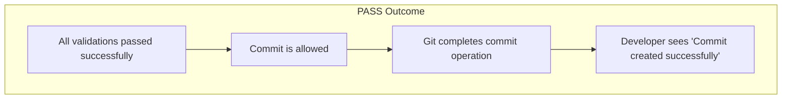
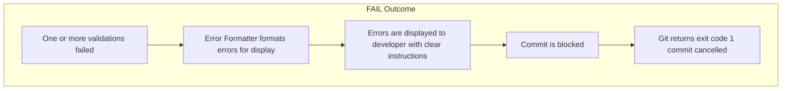

# Git Hooks Automation Suite — Execution Walkthrough

**File:** `docs/architecture/execution-walkthrough.md`  
**Date:** 22 June 2026  
**Version:** 1.0  
**Related Diagram:** `git-hook-execution-flow.mmd`

---

## Overview
This document describes the step-by-step execution flow of the Git Hooks Automation Suite when a developer runs **git commit**. It explains how the components interact during the **pre-commit** hook execution.

---

## Component Roles
| Component | Responsibility |
|---|---|
| **Git Hook** | Entry point triggered by `git commit` |
| **Hook Runner** | Orchestrates the entire execution flow |
| **Configuration Parser** | Reads and validates `config.yml` |
| **Validation Engine** | Executes checks (linting, tests, secrets scanning, format, etc.) |
| **Result Processor** | Aggregates and evaluates results |
| **Logger** | Logs all execution details |

---

## Execution Walkthrough

### Step 1 — Developer Initiates Commit
- **Action:** Developer runs `git commit -m "feature implementation"`.
- **What happens:** Git captures the commit message and identifies staged files.

### Step 2 — Git Triggers Pre-commit Hook
- **Action:** Git executes the `.git/hooks/pre-commit` script.
- **What happens:** The script runs and passes the commit context to the hook system.

### Step 3 — Hook Runner Initialization
- **Action:** Hook Runner process starts and sets up environment.
- **What happens:**
  - **Validate** that required dependencies and binaries are available.
  - **Initialize** the logging subsystem.

### Step 4 — Configuration Loading
- **Action:** Hook Runner locates and loads `config.yml`.
- **What happens:**
  - If `config.yml` is missing, **default settings** are used.
  - Configuration schema and required fields are **validated**.

### Step 5 — Configuration Parsing
- **Action:** Configuration Parser reads and parses the YAML configuration.
- **What happens:**
  - Parses validation rules, environment settings, and hook-specific configuration.
  - Builds an internal configuration object used by the Validation Engine.

### Step 6 — Hook Enabled Check
- **Action:** System checks whether the pre-commit hook is enabled in configuration.
- **Possible outcome:**
  - If disabled → **SKIP** outcome: log the reason and allow the commit.

### Step 7 — Validation Engine Initialization
- **Action:** Initialize validation components and prepare file detection.
- **What happens:**
  - Load rule definitions and any rule-specific dependencies.
  - Prepare change detection to determine which validations apply to staged files.

### Step 8 — Run Validations
The Validation Engine executes checks (usually in sequence or configurable order):

- **File Size Check** — Validates that no file exceeds the configured size limit.
- **Linting Check** — Runs linters on staged files.
- **Test Execution** — Runs unit tests related to changed code (where applicable).
- **Secrets Scanning** — Scans for secrets or credentials in commits.
- **Format Check** — Verifies code formatting compliance.

### Step 9 — Collect Results
- **What happens:**
  - Each validation returns a result: **pass / fail / warning**.
  - Results are aggregated with metadata (timing, affected files, rule id).
  - Distinguish **critical** vs **non-critical** failures according to configuration.

### Step 10 — Log Execution Details
- **What is recorded:**
  - **Timestamp** — Time of execution.
  - **Validations run** — Which checks were executed.
  - **Status** — Pass / Fail / Warning for each check.
  - **Execution duration** — Time taken per check.
  - **Errors** — Any errors encountered during execution.

### Step 11 — Determine Outcome
The Result Processor evaluates aggregated results and determines one of three outcomes: **PASS**, **FAIL**, or **SKIP**.
#### Pass Workflow

#### Fail Workflow

#### Skip Workflow
```mermaid
   graph TD
    subgraph SKIP [SKIP Outcome]
        S1[Hook disabled OR rule skipped] --> S2[Skip reason is logged]
        S2 --> S3[Commit is allowed]
        S3 --> S4[Git completes commit operation]
    end
  ```
---

## Interaction Flow Summary
A compact view of how components interact during a commit.

```mermaid
graph TD
    subgraph "Git Workflow"
        Commit([Git Commit]) --> Hook[Git Hook]
        Hook --> Runner[Runner]
        
        %% Horizontal relationship for Parser
        Runner --> Parser[Parser]
        
        Runner --> ValEngine[Validation Engine]
        ValEngine --> ResProc[Result Processor]
        
        %% Horizontal relationship for Logger
        ResProc --> Logger[Logger]
        
        ResProc --> Outcomes
        
        subgraph Outcomes [OUTCOMES]
            direction LR
            PASS[PASS]
            FAIL[FAIL]
            SKIP[SKIP]
        end
    end

    %% Styling to make it look clean
    style Outcomes fill:#f9f9f9,stroke:#333,stroke-width:1px
    style PASS fill:#d4edda,stroke:#28a745,stroke-width:1px
    style FAIL fill:#f8d7da,stroke:#dc3545,stroke-width:1px
    style SKIP fill:#fff3cd,stroke:#ffc107,stroke-width:1px
```

---

## Outcome Summary
| Outcome | Condition | Result |
|---|---|---|
| **PASS** | All validations passed | ✅ Commit created |
| **FAIL** | One or more validations failed | ❌ Commit blocked |
| **SKIP** | Hook disabled or rule skipped | ✅ Commit created |

---

## Related Documentation
| File | Description |
|---|---|
| `hook-execution-flow.png` | Architecture flow diagram |
| `git-hook-execution-flow.png` | Rendered diagram image |
| `architecture.md` | Overall architecture design |
| `component-interactions.md` | Component roles and responsibilities |

---

*End of Document*
